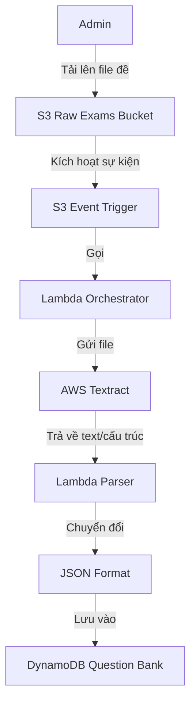
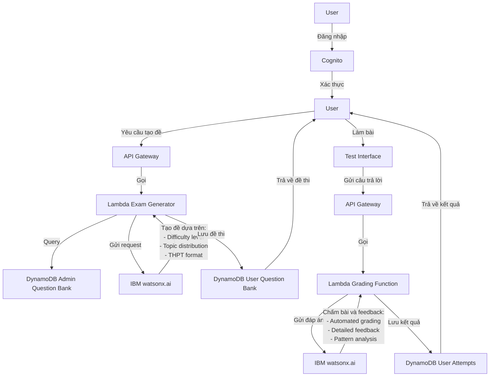
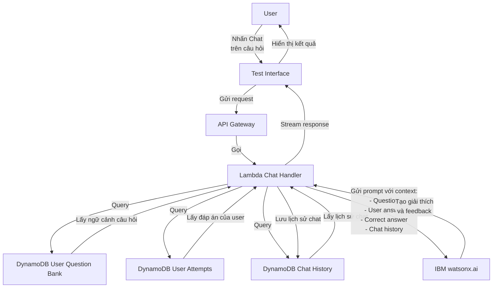

# KIẾN TRÚC HỆ THỐNG LUYỆN THI TIẾNG ANH

## 1. TỔNG QUAN PHÂN TẦNG

### Layer 1: Presentation Layer
- Frontend Web Application (React/Vue) host trên S3 + CloudFront
- Mobile App (optional)

### Layer 2: API Gateway Layer
- AWS API Gateway: Routing, rate limiting, authentication validation

### Layer 3: Authentication & Authorization Layer
- AWS Cognito: Quản lý user, admin authentication
- Role-based access control

### Layer 4: Application Layer
- AWS Lambda Functions: Xử lý business logic
  - Admin workflow functions
  - User workflow functions
  - Orchestration functions

### Layer 5: AI/LLM Layer (IBM Cloud)
- IBM watsonx.ai: LLM service
  - Generative AI cho tạo đề thi
  - Chấm bài tự động
  - Conversational AI cho chat học tập
- IBM Watson Assistant (optional): Chatbot framework

### Layer 6: Data Processing Layer
- AWS Textract: OCR và trích xuất text từ PDF/image
- AWS Lambda: Transform data sang JSON format
- AWS Step Functions: Orchestrate workflow trích xuất

### Layer 7: Storage Layer
- AWS S3:
  - Bucket 1: Đề thi gốc (PDF/image) từ admin
  - Bucket 2: Static assets của frontend
  - Bucket 3: User submissions, results
- AWS DynamoDB:
  - Table 1: Question Bank (câu hỏi đã extract)
  - Table 2: Exam Papers (đề thi hoàn chỉnh)
  - Table 3: User Attempts (lần làm bài)
  - Table 4: Chat History
- AWS RDS (alternative): PostgreSQL cho relational data

## 2. WORKFLOW CHI TIẾT

### 2.1 Admin Workflow - Upload và Trích Xuất Đề



**JSON Structure:**

**1. Admin Question Bank**
```json
{
  "questions": [
    {
      "id": "Q001",
      "type": "multiple_choice",
      "content": "What is the correct form of the verb?",
      "options": [
        "I go to school",
        "I goes to school",
        "I going to school",
        "I am go to school"
      ],
      "correct_answer": 0,
      "explanation": "The correct form is 'I go to school' because...",
      "tags": ["grammar", "present_simple"]
    }
  ]
}
```

**2. User Question Bank (Exam)**
```json
{
  "exam_id": "EXAM_USER_2024_001",
  "questions": [
    {
      "id": "UQ001",
      "is_generated": false,
      "admin_question_id": "Q001",
      "type": "multiple_choice",
      "content": "What is the correct form of the verb?",
      "options": [
        "I go to school",
        "I goes to school",
        "I going to school",
        "I am go to school"
      ],
      "correct_answer": 0,
      "explanation": "The correct form is 'I go to school' because...",
      "tags": ["grammar", "present_simple"]
    },
    {
      "id": "UQ002",
      "is_generated": true,
      "admin_question_id": "Q050"
    }
  ]
}
```

### 2.2 User Workflow - Tạo Đề và Làm Bài



### 2.3 User Workflow - Chat về Câu Hỏi



## 3. PHÂN CÔNG AWS vs IBM

### AWS Responsibilities:
- Infrastructure hosting (compute, storage, networking)
- Authentication & authorization
- Document processing và OCR
- Database và data persistence
- API management
- Static content delivery

### IBM Responsibilities:
- Large Language Model services
- Natural language understanding
- Generative AI cho tạo đề, chấm bài
- Conversational AI cho chat
- AI model training/fine-tuning (nếu cần customize)

## 4. CÁC THÀNH PHẦN CHÍNH

### 4.1 Admin Portal Components
- File Upload Interface
- Extraction Status Dashboard
- Question Bank Management
- Manual Review/Edit Interface

### 4.2 User Portal Components
- Authentication UI
- Exam Selection/Generation Interface
- Test Taking Interface (timer, question navigation)
- Results Dashboard
- Interactive Chat per Question
- Progress Tracking

### 4.3 Backend Services
- Authentication Service (Cognito)
- File Processing Service (Lambda + Textract)
- Exam Generation Service (Lambda + IBM AI)
- Grading Service (Lambda + IBM AI)
- Chat Service (Lambda + IBM AI)
- Data Access Layer (Lambda + DynamoDB)

## 5. TÍCH HỢP IBM WATSONX

### 5.1 Exam Generation
- Endpoint: IBM watsonx.ai foundation models
- Input: Question bank metadata, user level, topic preferences
- Output: Structured exam with 50 questions following THPT format

### 5.2 Grading Engine
- Input: Questions + correct answers + user answers
- Processing: Evaluate correctness, generate explanations
- Output: Score, detailed feedback per question

### 5.3 Chat Assistant
- Model: Conversational AI model from watsonx
- Context: Question, correct answer, user answer, learning objectives
- Capability: Explain concepts, answer follow-up questions, provide examples

## 6. BẢO MẬT VÀ HIỆU NĂNG

### Security Layers:
- API Gateway: API keys, throttling
- Cognito: JWT tokens, refresh tokens
- IAM Roles: Least privilege access
- Encryption: At rest (S3, DynamoDB) and in transit (HTTPS)
- VPC: Isolate sensitive resources

### Performance Optimization:
- CloudFront CDN cho static content
- DynamoDB On-Demand hoặc Provisioned capacity
- Lambda concurrent execution limits
- Caching: API Gateway cache, DynamoDB DAX
- Connection pooling cho IBM API calls

## 7. MONITORING VÀ LOGGING

- AWS CloudWatch: Logs, metrics, alarms
- AWS X-Ray: Distributed tracing
- CloudWatch Dashboards: Real-time monitoring
- IBM Cloud Monitoring: AI service usage tracking
- Custom metrics: User engagement, exam completion rates