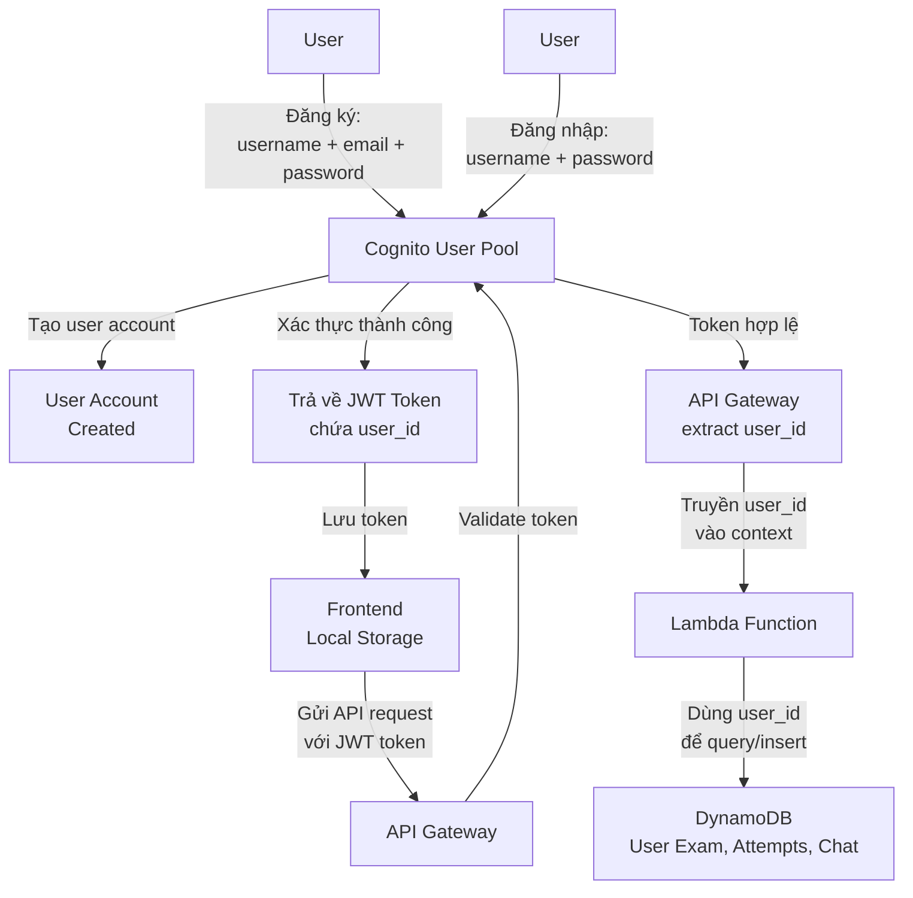
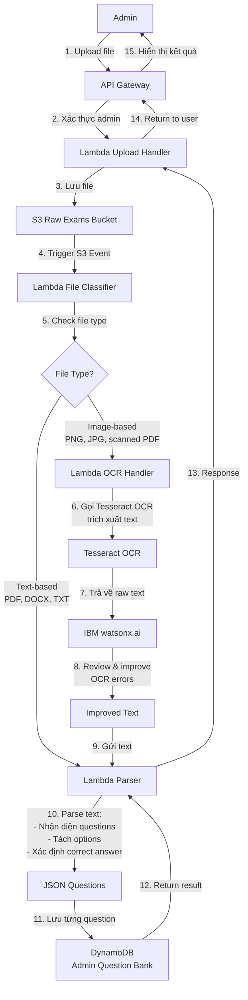
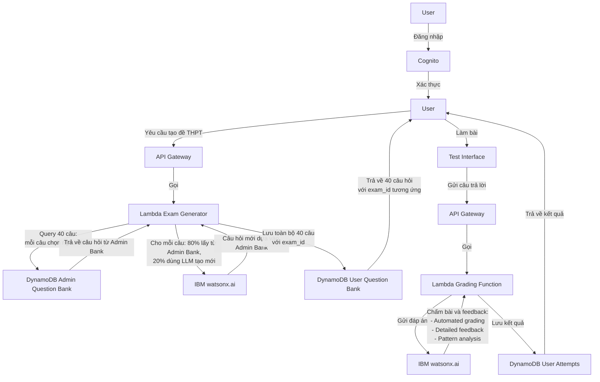
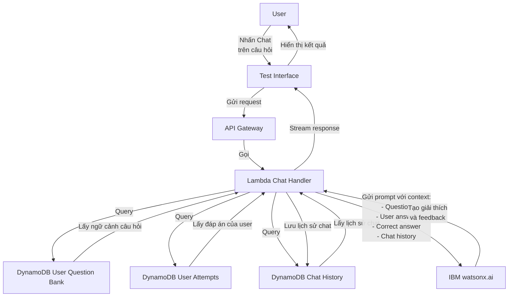

# KIẾN TRÚC HỆ THỐNG LUYỆN THI TIẾNG ANH

## 1. TỔNG QUAN PHÂN TẦNG

### Layer 1: Presentation Layer
- Frontend Web Application (React/Vue) host trên S3 + CloudFront

### Layer 2: API Gateway Layer
- AWS API Gateway: Routing, rate limiting, authentication validation

### Layer 3: Authentication & Authorization Layer
- AWS Cognito: Quản lý user, admin authentication
- Role-based access control

### Layer 4: Application Layer
- AWS Lambda Functions: Xử lý business logic
  - Admin workflow functions
  - User workflow functions
  - Orchestration functions

### Layer 5: AI/LLM Layer (IBM Cloud)
- IBM watsonx.ai: LLM service
  - Generative AI cho tạo đề thi
  - Chấm bài tự động
  - Conversational AI cho chat học tập
- IBM Watson Assistant (optional): Chatbot framework

### Layer 6: Data Processing Layer
- Tesseract OCR: OCR và trích xuất text từ PDF/image
- AWS Lambda: Transform data sang JSON format
- AWS Step Functions: Orchestrate workflow trích xuất

### Layer 7: Storage Layer
- AWS S3:
  - Bucket 1: Đề thi gốc (PDF/image) từ admin
  - Bucket 2: Static assets của frontend
  - Bucket 3: User submissions, results
- AWS DynamoDB:
  - Table 1: Question Bank (câu hỏi đã extract)
  - Table 2: Exam Papers (đề thi hoàn chỉnh)
  - Table 3: User Attempts (lần làm bài)
  - Table 4: Chat History
- AWS RDS (alternative): PostgreSQL cho relational data

## 2. AUTHENTICATION & AUTHORIZATION

### 2.0 User Registration & Login Flow

**Luồng chi tiết:**

1. **Đăng ký (Registration)**:
   - User nhập: `username` + `email` + `password`
   - Cognito tạo account và tự động sinh `user_id`
   - User nhận email xác thực (optional)

2. **Đăng nhập (Login)**:
   - User nhập: `username` + `password`
   - Cognito xác thực → trả về **JWT token**
   - JWT token chứa:
     - `sub`: Cognito user ID (dùng làm user_id)
     - `email`, `username`
   - Frontend lưu JWT token vào local storage

3. **Sử dụng API (Authenticated Requests)**:
   - Frontend gửi request với `Authorization: Bearer <JWT_token>`
   - API Gateway validate token qua Cognito
   - API Gateway extract `user_id` từ token
   - Lambda nhận `user_id` từ `event.requestContext.authorizer.claims.sub`
   - Lambda dùng `user_id` để:
     - Tạo exam mới trong `DynamoDB User Exam` (exam_id + user_id)
     - Query exam của user
     - Lưu attempt results
     - Lưu chat history

**Admin Permission:**
- `is_admin` attribute được set thủ công bởi developer qua **AWS Console**
- Không có trong luồng đăng ký/đăng nhập tự động
- Lambda có thể check `event.requestContext.authorizer.claims['custom:is_admin']` để phân quyền admin features

**Lợi ích:**
- **Không cần User database**: Cognito quản lý hết username, email, password
- **user_id tự động**: Lấy từ JWT token (claim `sub`), không cần tạo thủ công
- **Bảo mật**: API Gateway tự động reject request nếu JWT token không hợp lệ
- **Đơn giản**: Frontend chỉ cần lưu JWT token, gửi kèm mọi request

## 3. WORKFLOW CHI TIẾT

### 3.1 Admin Workflow - Upload và Trích Xuất Đề

**Luồng chi tiết:**

1. **Upload File (Steps 1-5)**:
   - Admin upload file qua Frontend
   - API Gateway xác thực admin (JWT token với `custom:is_admin = true`)
   - Lambda Upload Handler nhận file và lưu vào S3 Raw Exams Bucket
   - S3 Event trigger kích hoạt Lambda File Classifier
   - Lambda File Classifier kiểm tra file type

2. **Text-based Flow (Steps 10-15)**:
   - Nếu file là **Text-based** (PDF có text layer, DOCX, TXT):
   - Lambda Parser trích xuất text trực tiếp
   - Parse text thành structured data:
     - Nhận diện từng question (Single Choice hoặc Group Choice)
     - Tách options (A, B, C, D)
     - Xác định correct answer
   - Tạo JSON questions và lưu vào DynamoDB Admin Question Bank
   - Return kết quả về Lambda Parser → Lambda Upload Handler → User

3. **Image-based Flow (Steps 6-15)**:
   - Nếu file là **Image-based** (PNG, JPG, scanned PDF):
   - Lambda OCR Handler gọi Tesseract OCR để trích xuất raw text
   - Tesseract trả về raw text
   - Gửi raw text đến IBM watsonx.ai để review & improve (fix OCR errors, chuẩn hóa)
   - Text đã được improve gửi đến Lambda Parser
   - Lambda Parser parse text → JSON questions → Lưu vào Admin Question Bank
   - Return kết quả về Lambda Parser → Lambda Upload Handler → User

4. **Save Questions to Database (Step 11)**:
   - Đối tượng lưu: **Question** (không phải exam paper)
   - Mỗi question có:
     - `id`: Unique ID (0 - 999,999,999)
     - `type`: 0 (Single Choice) hoặc 1 (Group Choice)
     - `content`/`context`: Nội dung câu hỏi
     - `options`: Array 4 đáp án
     - `correct_answer`: Index đáp án đúng

5. **Return to User (Steps 12-15)**:
   - Admin Question Bank trả về kết quả cho Lambda Parser
   - Lambda Parser gửi response về Lambda Upload Handler
   - Lambda Upload Handler return về user qua API Gateway
   - Frontend hiển thị:
     - Tổng số questions đã lưu
     - Danh sách question IDs
     - Các lỗi (nếu có)

**Technical Notes:**
- **File Types**:
  - Text-based: PDF (with text layer), DOCX, TXT, RTF
  - Image-based: PNG, JPG, JPEG, scanned PDF (no text layer)
- **Tesseract trong Lambda**: Cài đặt qua Lambda Layer hoặc Container Image
- **IBM watsonx.ai**: Chỉ dùng cho image-based flow để improve OCR accuracy
- **Timeout**: Lambda OCR có thể cần timeout cao (5-15 phút) cho file lớn
- **Error Handling**: Retry mechanism cho OCR failures, manual review cho parse errors

**JSON Structure:**

Xem chi tiết tại file [database-schema.md](database-schema.md)

### 3.2 User Workflow - Tạo Đề và Làm Bài

### 3.3 User Workflow - Chat về Câu Hỏi

## 6. BẢO MẬT VÀ HIỆU NĂNG

### Security Layers:
- API Gateway: API keys, throttling
- Cognito: JWT tokens, refresh tokens
- IAM Roles: Least privilege access
- Encryption: At rest (S3, DynamoDB) and in transit (HTTPS)
- VPC: Isolate sensitive resources

### Performance Optimization:
- CloudFront CDN cho static content
- DynamoDB On-Demand hoặc Provisioned capacity
- Lambda concurrent execution limits
- Caching: API Gateway cache, DynamoDB DAX
- Connection pooling cho IBM API calls

## 7. MONITORING VÀ LOGGING

- AWS CloudWatch: Logs, metrics, alarms
- AWS X-Ray: Distributed tracing
- CloudWatch Dashboards: Real-time monitoring
- IBM Cloud Monitoring: AI service usage tracking
- Custom metrics: User engagement, exam completion rates