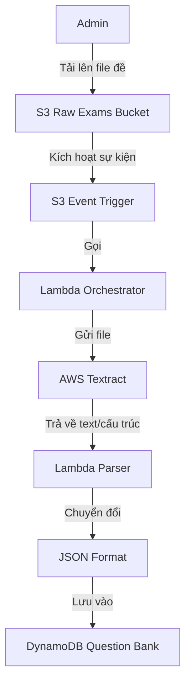
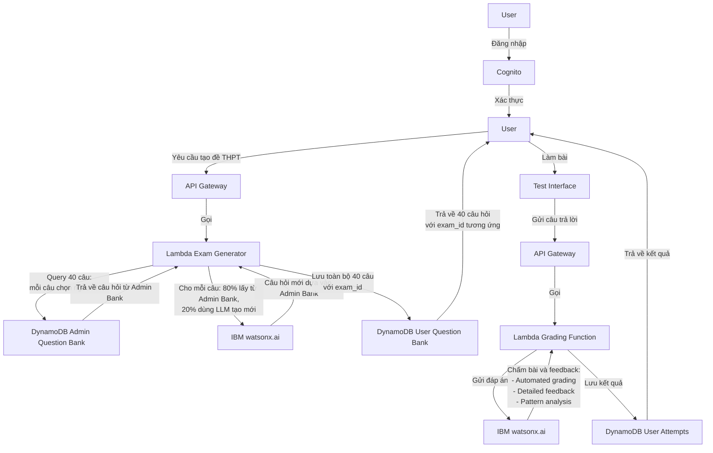
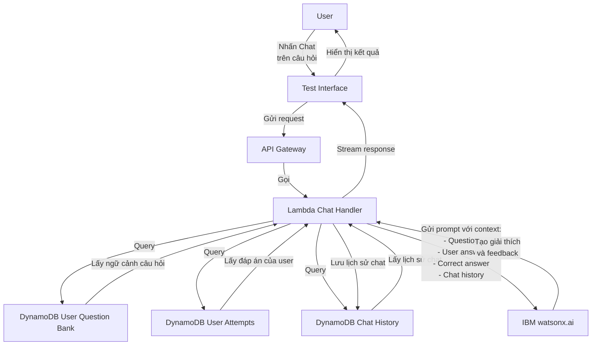

# KIẾN TRÚC HỆ THỐNG LUYỆN THI TIẾNG ANH

## 1. TỔNG QUAN PHÂN TẦNG

### Layer 1: Presentation Layer
- Frontend Web Application (React/Vue) host trên S3 + CloudFront

### Layer 2: API Gateway Layer
- AWS API Gateway: Routing, rate limiting, authentication validation

### Layer 3: Authentication & Authorization Layer
- AWS Cognito: Quản lý user, admin authentication
- Role-based access control

### Layer 4: Application Layer
- AWS Lambda Functions: Xử lý business logic
  - Admin workflow functions
  - User workflow functions
  - Orchestration functions

### Layer 5: AI/LLM Layer (IBM Cloud)
- IBM watsonx.ai: LLM service
  - Generative AI cho tạo đề thi
  - Chấm bài tự động
  - Conversational AI cho chat học tập
- IBM Watson Assistant (optional): Chatbot framework

### Layer 6: Data Processing Layer
- AWS Textract: OCR và trích xuất text từ PDF/image
- AWS Lambda: Transform data sang JSON format
- AWS Step Functions: Orchestrate workflow trích xuất

### Layer 7: Storage Layer
- AWS S3:
  - Bucket 1: Đề thi gốc (PDF/image) từ admin
  - Bucket 2: Static assets của frontend
  - Bucket 3: User submissions, results
- AWS DynamoDB:
  - Table 1: Question Bank (câu hỏi đã extract)
  - Table 2: Exam Papers (đề thi hoàn chỉnh)
  - Table 3: User Attempts (lần làm bài)
  - Table 4: Chat History
- AWS RDS (alternative): PostgreSQL cho relational data

## 2. WORKFLOW CHI TIẾT

### 2.1 Admin Workflow - Upload và Trích Xuất Đề

**JSON Structure:**

Xem chi tiết tại file [database-schema.md](database-schema.md)

### 2.2 User Workflow - Tạo Đề và Làm Bài

### 2.3 User Workflow - Chat về Câu Hỏi

## 6. BẢO MẬT VÀ HIỆU NĂNG

### Security Layers:
- API Gateway: API keys, throttling
- Cognito: JWT tokens, refresh tokens
- IAM Roles: Least privilege access
- Encryption: At rest (S3, DynamoDB) and in transit (HTTPS)
- VPC: Isolate sensitive resources

### Performance Optimization:
- CloudFront CDN cho static content
- DynamoDB On-Demand hoặc Provisioned capacity
- Lambda concurrent execution limits
- Caching: API Gateway cache, DynamoDB DAX
- Connection pooling cho IBM API calls

## 7. MONITORING VÀ LOGGING

- AWS CloudWatch: Logs, metrics, alarms
- AWS X-Ray: Distributed tracing
- CloudWatch Dashboards: Real-time monitoring
- IBM Cloud Monitoring: AI service usage tracking
- Custom metrics: User engagement, exam completion rates